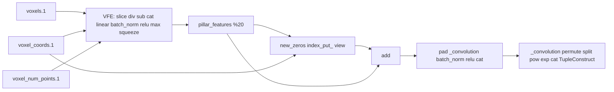

# PointPillar TorchScript Graph: Netron Op Reference

This report maps **Netron op names** (as shown in Netron) to **graph ID (%xx)**, **shape**, and **purpose**. Use it to match what you see in Netron to the traced graph.

**Graph source:** First terminal block = compiled; second = uncompiled. IDs below are uncompiled; compiled may differ (e.g. %26 vs %20 for pillar_features).

---

## 0. From LiDAR (point cloud) to voxels

The **traced model** only sees **voxels**, **voxel_num_points**, and **voxel_coords**. Those are produced **before** the model by a **voxelization** step that runs in the dataset pipeline (CPU / data loader), not inside the TorchScript graph.

**Pipeline:**

1. **LiDAR → point cloud**  
   Raw sensor output: a set of 3D points, each with **x, y, z** and often **intensity** (and optionally more). Stored per frame (e.g. KITTI `.bin`: `(N, 4)` float32).  
   - **Code:** e.g. `get_lidar(sample_idx)` in `pcdet/datasets/kitti/kitti_dataset.py` loads the file into `points` shape `(N, 4)`.

2. **Point cloud → feature encoding (optional)**  
   Points are passed through the **point feature encoder** (e.g. `absolute_coordinates_encoding`), which can select/reorder features (e.g. `['x','y','z','intensity']`). Output is still **one row per point**, shape `(N, 3+C)`.  
   - **Code:** `pcdet/datasets/processor/point_feature_encoder.py`; called inside `prepare_data()` in `pcdet/datasets/dataset.py`.

3. **Crop and shuffle**  
   - **mask_points_and_boxes_outside_range:** keep only points inside `POINT_CLOUD_RANGE` (e.g. `[0, -39.68, -3, 69.12, 39.68, 1]` for KITTI).  
   - **shuffle_points:** random permutation of points (train only).  
   - **Code:** `pcdet/datasets/processor/data_processor.py`.

4. **Point cloud → voxels (voxelization)**  
   - A **voxel grid** is defined by:
     - **POINT_CLOUD_RANGE** (e.g. xmin, ymin, zmin, xmax, ymax, zmax),
     - **VOXEL_SIZE** (e.g. `[0.16, 0.16, 4]` for PointPillar: 0.16 m in x/y, 4 m in z → effectively “pillars”).
   - Each point is assigned to the voxel (pillar) that contains it:  
     `voxel_idx = floor((point_xyz - range_min) / VOXEL_SIZE)`.
   - Points in the same voxel are grouped; each voxel is padded to **MAX_POINTS_PER_VOXEL** (e.g. 32). If there are more points, they are truncated; if fewer, the slot is padded (and **voxel_num_points** stores the real count).
   - Outputs:
     - **voxels:** `(M, max_pts, 4)` — M voxels, each with up to 32 points, 4 features (x, y, z, intensity).
     - **coordinates:** `(M, 3)` — grid indices (z, y, x) per voxel (no batch index yet).
     - **num_points_per_voxel:** `(M,)` — number of valid points per voxel.
   - **Code:** `transform_points_to_voxels` in `pcdet/datasets/processor/data_processor.py`, which wraps **spconv**’s `VoxelGenerator` / `Point2VoxelCPU3d` (`VoxelGeneratorWrapper.generate(points)`).

5. **Batch collate**  
   When batching, `voxel_coords` is padded with a **batch index** in the first column → shape `(M, 4)` (batch_idx, z, y, x).  
   - **Code:** `collate_batch` in `pcdet/datasets/dataset.py` (pad coords with `constant_values=i` for sample index `i`).

So: **LiDAR point cloud (N points) → voxelization (grid + binning + padding) → voxels, voxel_num_points, voxel_coords** → these three are the **inputs to the traced model**. The traced graph does **not** contain the voxelization; it is done in the dataset pipeline before the model runs.

**Config (KITTI PointPillar):** `cfgs/kitti_models/pointpillar.yaml`:  
`VOXEL_SIZE: [0.16, 0.16, 4]`, `MAX_POINTS_PER_VOXEL: 32`, `MAX_NUMBER_OF_VOXELS: { test: 40000 }`.

---

## 1. Inputs

| Netron name        | ID (%xx)             | Shape           | Purpose |
|--------------------|----------------------|-----------------|--------|
| voxels.1           | %voxels.1            | (M, max_pts, 4) | Voxel point features: M pillars, max points per pillar, 4 = x, y, z, intensity. |
| voxel_coords.1     | %voxel_coords.1      | (M, 4)          | Pillar grid coords: batch_idx, z, y, x (int). |
| voxel_num_points.1 | %voxel_num_points.1  | (M,)            | Number of points per pillar (int). |

---

## 2. VFE (PillarVFE) — feature build and mask

| Netron name   | ID (%xx) | Shape     | Purpose |
|---------------|----------|-----------|--------|
| slice         | %25, %36, %41, %53 (on coords); internal in VFE | (M, 4) or reduced | Slice voxels / voxel_coords for mean, coords, or indices. |
| type_as       | —        | —         | Match dtype/device (e.g. for mask). |
| div           | —        | —         | points_mean = sum / voxel_num_points. |
| sub           | —        | —         | f_cluster (point − mean), f_center (point − pillar center). |
| zeros_like    | —        | —         | Allocate f_center tensor. |
| cat           | —        | (M, max_pts, D) | Concat [voxel_features, f_cluster, f_center] (and optional distance). |
| size          | —        | —         | Tensor size for padding indicator. |
| NumToTensor   | —        | —         | JIT: convert size to tensor. |
| ScalarImplicit| —        | —         | JIT: scalar handling. |
| arange        | —        | —         | Build padding mask (compare actual_num vs index). |
| unsqueeze     | —        | —         | Expand dims for mask/broadcast. |
| view          | —        | —         | Reshape for mask or features. |
| to            | —        | —         | Cast (e.g. to long or device). |
| gt            | —        | —         | actual_num > index → padding indicator. |
| mul_          | —        | —         | Apply mask to features (inplace). |

---

## 3. VFE (PillarVFE) — PFN → pillar_features

| Netron name   | ID (%xx) | Shape   | Purpose |
|---------------|----------|---------|--------|
| linear        | —        | (M, max_pts, 64) → (M, max_pts, 64) or 32 | PFNLayer Linear (e.g. weight 64×10: 10→64). |
| weight〈64×10〉| —        | (64, 10)| First PFN linear weight (input 10, output 64). |
| permute       | —        | —       | (B, L, C) → (B, C, L) for BatchNorm1d. |
| batch_norm    | —        | —       | BatchNorm1d (64); weight, bias, running_mean, running_var 〈64〉. |
| relu          | —        | —       | ReLU after linear/BN. |
| max           | —        | —       | Max over points in each pillar → one vector per pillar. |
| squeeze       | —        | —       | Remove dim → **pillar_features**. |
| **(output)**  | **%20** (uncompiled) / **%26** (compiled) | **(M, 64)** | Pillar features out of VFE. |

---

## 4. Scatter and dummy graph edge

| Netron name   | ID (%xx)             | Shape           | Purpose |
|---------------|----------------------|-----------------|--------|
| sum           | %93 / %99            | scalar          | pillar_features.sum() for 0*sum edge. |
| new_zeros     | %spatial.1           | (B, 64, H*W)    | Empty BEV grid from pillar_features; e.g. (1, 64, 214272). |
| mul           | %95 / %101           | scalar          | 0 * sum (constant 0). |
| view          | %spatial_features.1  | (B, 64, ny, nx) | Reshape spatial to (1, 64, 496, 432). |
| add (other=0) | %input.1             | (B, 64, ny, nx) | spatial_features + 0*sum; input to backbone. |

Scatter indexing (batch_idx, spatial_idx) and writing into `spatial` may appear in Netron as **slice**, **select**, **index_put_** or **mul_** depending on export; IDs for indices: %batch_idx.1, %spatial_idx.1; write uses %20/%26 (pillar_features) into %spatial.1.

---

## 5. Backbone 2D (BaseBEVBackbone)

| Netron name     | ID (%xx) | Shape        | Purpose |
|-----------------|----------|--------------|--------|
| pad             | —        | —            | ZeroPad2d before conv. |
| _convolution    | —        | (B, C, H, W) | Conv2d 64×64×3×3, 128×64×3×3, 128×128×3×3, 256×128×3×3, 256×256×3×3 (blocks). |
| weight〈…×3×3〉 | —        | (out, in, 3, 3) | Conv2d kernel. |
| batch_norm      | —        | —            | BatchNorm2d after each conv (64, 128, 256). |
| relu            | —        | —            | ReLU after BN. |
| cat             | —        | —            | Concat multi-scale features. |
| size            | —        | —            | Spatial size for stride / upsample. |
| NumToTensor / Int | —      | —            | JIT: size → tensor. |
| view            | —        | —            | Reshape for concat or output. |
| **(output)**    | **%103** / **%109**  | **(B, C', H', W')** | spatial_features_2d into head. |

Deconv / upsample blocks appear as further **_convolution** (e.g. 64×128×1×1, 128×128×2×2, 256×128×4×4) then **cat**.

---

## 6. Dense Head (AnchorHeadSingle)

| Netron name     | ID (%xx) | Shape        | Purpose |
|-----------------|----------|--------------|--------|
| _convolution    | —        | —            | 1×1 conv: cls (e.g. 18×384×1×1), dir (e.g. 12×384×1×1), box (e.g. 42×384×1×1). |
| weight〈18×384×1×1〉 etc. | — | —     | Head conv weights. |
| repeat          | —        | —            | Expand for anchors or batch. |
| size            | —        | —            | Feature map size. |
| permute         | —        | —            | NCHW → NHWC for cls/box. |
| contiguous      | —        | —            | Contiguous layout. |
| split           | —        | —            | Split channels (e.g. per anchor). |
| ListUnpack      | —        | —            | Unpack list of tensors. |
| pow             | —        | —            | For box decoding (e.g. exp). |
| add             | —        | —            | Anchor center + offset. |
| sqrt            | —        | —            | Decode extent. |
| mul             | —        | —            | Scale or decode. |
| exp             | —        | —            | Decode log-scale. |
| cat             | —        | —            | Concat decoded box components. |
| TupleConstruct  | —        | —            | Build (cls_preds, box_preds). |
| TupleUnpack     | %106, %107 / %112, %113 | — | Unpack to two tensors. |
| **(return)**    | **%110** / **%116**    | **(Tensor, Tensor)** | (batch_cls_preds, batch_box_preds). |

---

## 7. Data flow (summary)

**Shape flow (e.g. KITTI, B=1):**  
(M, 32, 4), (M,), (M, 4) → VFE → (M, 64) → scatter → (1, 64, 496, 432) → add → backbone → (1, C', H', W') → head → (cls_preds, box_preds).

---

## 8. How to reproduce

1. **Export:** `python export.py` or `python export.py --compile` → e.g. `pointpillar_traced.pt`.
2. **Print graph:** `python view_torchscript.py`.
3. **Netron:** Open the same `.pt` in Netron; op names in the left/tree view match the **Netron name** column above.
